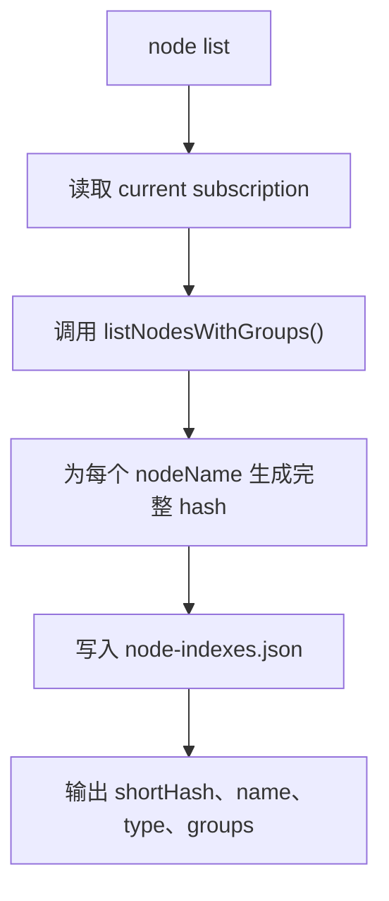
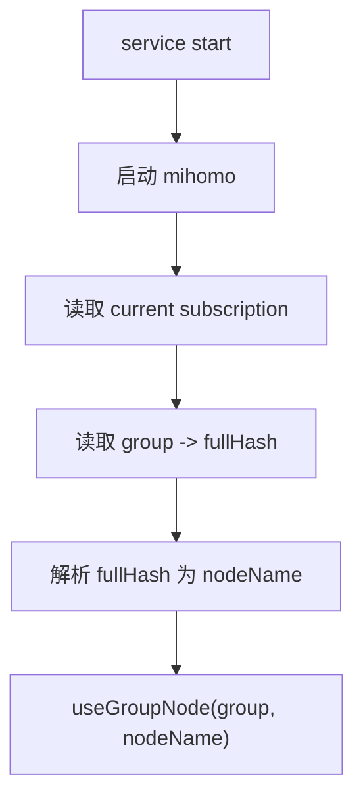

# NodeHashIndex_20260617

## 核心功能（WHAT）

为 mihoro-cli 增加一层 CLI 专属节点 hash 索引。每个代理节点基于当前订阅 id 和原始节点名生成完整 SHA-256 hash，CLI 默认展示前 8 位短 hash，并允许用户通过 hash 前缀完成节点切换和默认节点保存。

### 需求背景（WHY）

当前 `node use` 和 `group use` 都要求用户输入原始节点名。订阅节点名通常包含地区、倍率、符号、空格或特殊字符，在 shell 中输入、复制、转义和脚本处理都不方便。

用户希望 mihoro-cli 的节点操作体验接近 Docker 短 ID：列表里看到短 hash，命令里用短 hash 指定资源，内部再解析到真实对象。

### 需求目标（GOAL）

- `node list` 展示每个节点的 8 位短 hash。
- `node use <hash> --group <group>` 使用 hash 或 hash 前缀切换节点。
- `group use <group> <hash>` 使用 hash 或 hash 前缀切换节点。
- 节点参数只接受 hash 或 hash 前缀，不接受原始节点名作为节点参数。
- mihoro-cli 保存完整 hash，执行时重新解析为当前订阅下的原始节点名。
- hash 基于 `subscriptionId + nodeName` 生成，不同订阅的节点索引互相隔离。
- 节点索引使用 JSON 持久化，便于 CLI 自己读写和后续扩展。

### 范围边界

纳入范围：

- 新增节点 hash 类型、节点索引类型和节点索引 JSON 读写模块。
- 使用 Node.js 标准库 `crypto` 生成 SHA-256 完整 hash。
- `node list` 刷新当前订阅节点索引，并输出短 hash。
- `node use` 和 `group use` 将节点参数解析为 hash，再切换对应原始节点名。
- 默认节点保存完整 hash，并在启动应用默认节点时重新解析。
- 保留对旧 `subscriptionDefaultNodes` 中原始节点名的兼容处理或迁移路径。
- 针对 hash 解析、冲突、缺失索引和旧配置兼容补充测试。

不纳入范围：

- 不修改 mihomo profile 或 runtime config 中的节点名。
- 不扩展 mihomo API。
- 不把代理组名 hash 化。
- 不新增 TUI。
- 不把 hash 作为跨订阅共享标识。

## 实现流程（HOW）

### 总体技术决策

采用“完整 hash 持久化 + 短 hash 展示 + 前缀解析”的模型。

- 完整 hash：SHA-256 十六进制字符串，作为 mihoro-cli 内部节点 ID。
- 短 hash：完整 hash 前 8 位，只作为默认展示。
- 输入解析：接受完整 hash 或任意长度前缀；前缀必须唯一。
- 原始节点名：只作为 mihomo API 调用参数和列表辅助展示，不再作为 CLI 节点参数。

hash 输入建议使用明确分隔符：

```ts
sha256(`${subscriptionId}\0${nodeName}`)
```

这样可以避免简单字符串拼接导致的边界歧义。

### 状态归属

新增节点索引文件，建议路径放在 mihoro 数据目录下：

```text
~/.config/mihoro/node-indexes.json
```

建议类型：

```ts
interface NodeIndexFile {
  subscriptions: Record<string, SubscriptionNodeIndex>
}

interface SubscriptionNodeIndex {
  updatedAt: string
  nodes: Record<string, NodeIndexEntry>
}

interface NodeIndexEntry {
  hash: string
  shortHash: string
  name: string
  type?: string
  groups: string[]
}
```

`hash` 是完整 SHA-256，`shortHash` 是默认展示字段。`groups` 来自当前 mihomo API 中可选择该节点的可见代理组。

默认节点配置建议从原来的“保存原始节点名”迁移为“保存完整 hash”：

```ts
interface MihoroConfig {
  proxyHost: string
  proxyBypass: string[]
  defaultNodes: Record<string, string>
  subscriptionDefaultNodes: Record<string, Record<string, string>>
}
```

短期可复用 `subscriptionDefaultNodes` 字段，但新写入值必须是完整 hash。为了降低语义混乱，设计上推荐新增更准确字段：

```ts
subscriptionDefaultNodeHashes: Record<string, Record<string, string>>
```

兼容读取顺序：

1. 优先读取 `subscriptionDefaultNodeHashes[subscriptionId][group]`。
2. 如果不存在，再读取旧 `subscriptionDefaultNodes[subscriptionId][group]`。
3. 旧值如果是完整 hash 或可解析 hash 前缀，则按 hash 处理。
4. 旧值如果是原始节点名，则在当前索引中按节点名查找并迁移为完整 hash。

### 节点索引刷新流程



约束：

- `node list` 是主要刷新入口。
- 刷新只更新当前订阅的索引，不覆盖其他订阅索引。
- 同一订阅同一节点名生成的完整 hash 必须稳定。

### 节点 hash 解析流程

新增解析函数，建议放在新模块 `src/config/node-index.ts` 或 `src/mihomo/node-index.ts`。由于它负责 CLI 状态文件，推荐放在 `src/config/node-index.ts`。

建议函数：

- `hashNodeName(subscriptionId: string, nodeName: string): string`
- `shortNodeHash(hash: string): string`
- `refreshNodeIndexForSubscription(subscriptionId: string): Promise<SubscriptionNodeIndex>`
- `resolveNodeHash(subscriptionId: string, value: string): Promise<NodeIndexEntry>`

解析规则：

1. 读取当前订阅索引。
2. 用输入值匹配 `entry.hash.startsWith(value)`。
3. 没有匹配时，自动刷新一次当前订阅索引后重试。
4. 仍没有匹配时，报错：节点 hash 不存在，提示执行 `node list` 查看 hash。
5. 多个匹配时，报错：hash 前缀不唯一，提示输入更长前缀或完整 hash。
6. 输入值等于某个原始节点名但不是 hash 前缀时，也按 hash 不存在处理，不走原始节点名 fallback。

### CLI 命令调整

`node list` 输出调整为 hash 优先：

```text
Selectable nodes: 3
1a2b3c4d    name=HK 01    type=Shadowsocks    groups=Proxy,Auto
```

`node use` 参数语义调整：

```bash
mihoro-cli node use <node-hash> --group <group>
```

执行流程：

1. 读取当前订阅。
2. 解析 `<node-hash>` 为索引条目。
3. 使用解析出的 `entry.name` 调用 `assertGroupCanUseNode(group, entry.name)`。
4. 调用 `useGroupNode(group, entry.name)`。
5. 保存默认节点 hash。

`group use` 参数语义调整：

```bash
mihoro-cli group use <group> <node-hash>
```

执行流程同 `node use`。

### 启动默认节点应用

`startCore()` 中的默认节点应用逻辑需要从“直接使用保存的节点名”改为“保存值解析为节点名”：



如果索引缺失或过期：

- 启动后 mihomo API 可用时，刷新当前订阅索引。
- 再解析保存的完整 hash。
- 解析失败时，报错说明保存的默认节点 hash 已失效，需要重新 `node list` 并重新选择节点。

### 文件触点

- `src/lib/paths.ts`
  - 新增 `nodeIndexesPath()`。
- `src/lib/types.ts`
  - 新增节点索引相关类型。
  - 可新增 `subscriptionDefaultNodeHashes` 字段。
- `src/config/node-index.ts`
  - 新增节点 hash、索引读写、刷新和解析逻辑。
- `src/config/state.ts`
  - 新增按订阅读写默认节点 hash 的 helper。
  - 兼容旧默认节点名并支持迁移。
- `src/index.ts`
  - 调整 `node list` 输出。
  - 调整 `node use` 和 `group use` 参数解析与保存逻辑。
- `src/mihomo/core.ts`
  - 启动应用默认节点时改为解析 hash。
- `README.md`
  - 更新节点命令示例。

### 失败处理

- hash 不存在：提示 `Node hash not found: <value>. Run "mihoro-cli node list" to refresh and view node hashes.`
- hash 前缀不唯一：列出匹配的短 hash 和节点名，提示输入更长前缀。
- 原始节点名输入：按 hash 不存在处理，提示只接受 node hash。
- 保存的默认 hash 解析失败：启动或应用默认节点失败，并提示重新选择默认节点。
- 索引 JSON 损坏：按空索引处理并允许刷新；如果写入失败，命令失败并报告路径。

## 测试用例

### 编译检查

- `pnpm run typecheck`
- `pnpm run build`

### 自动化检查

- `hashNodeName(subscriptionId, nodeName)` 对同一输入稳定，对不同订阅或不同节点名产生不同完整 hash。
- `shortNodeHash()` 返回 8 位短 hash。
- `resolveNodeHash()` 能用完整 hash 解析节点。
- `resolveNodeHash()` 能用唯一前缀解析节点。
- `resolveNodeHash()` 在前缀冲突时报错。
- `resolveNodeHash()` 不接受原始节点名 fallback。
- 默认节点 helper 新写入完整 hash。
- 旧默认节点名能在当前索引存在时迁移或兼容解析。

### 手工检查

- 启动 mihomo 后执行 `mihoro-cli node list`，确认输出包含 8 位短 hash。
- 使用短 hash 执行 `mihoro-cli node use <hash> --group <group>`，确认代理组切换成功。
- 使用短 hash 执行 `mihoro-cli group use <group> <hash>`，确认代理组切换成功。
- 输入原始节点名执行切换，确认失败并提示使用 hash。
- 切换订阅后执行 `node list`，确认 hash 按新订阅重新生成。
- 保存默认节点后重启服务，确认默认节点通过 hash 重新解析并应用。

### 回归检查

- `sub use` 后 runtime 与运行态仍保持一致。
- `service start` 仍能正常启动 mihomo。
- `proxy enable` 仍能启动或重启 mihomo 并启用系统代理。
- `group list` 仍能显示当前代理组选择。
