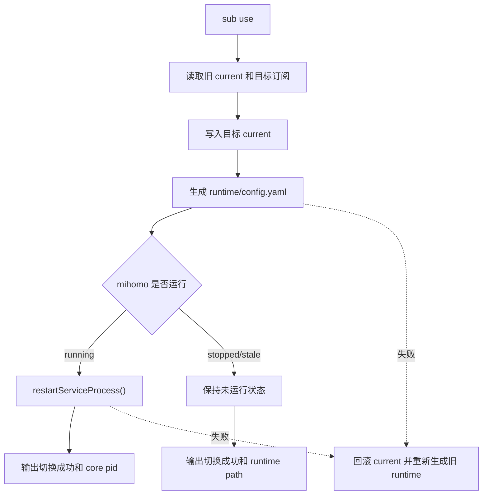

# SubscriptionSwitchRuntimeState_20260616

## 核心功能（WHAT）

让 mihoro-cli 的订阅切换形成完整闭环：执行 `sub use <name-or-id>` 后，当前订阅状态、runtime config、运行中的 mihomo core、`node list` / `group list` 看到的 API 数据，以及默认代理组节点偏好都属于同一个订阅。

### 需求背景（WHY）

当前 `sub use` 只更新 `subscriptions.yaml.current` 并重新生成 `runtime/config.yaml`。如果 mihomo 已经在运行，它仍使用旧 runtime，所以 `node list` 和 `group list` 会继续读取旧订阅的运行态。

同时，`defaultNodes` 现在是全局配置。用户在订阅 A 保存的 group/node 默认选择，切到订阅 B 后仍可能被启动流程应用，导致新订阅继承旧订阅的代理组偏好。

Clash Party 的 profile 切换语义是“切换 current 后同步更新 core 运行态”。mihoro-cli 需要对齐这个行为。

### 需求目标（GOAL）

- `sub use` 成功后，订阅 current、runtime 文件和运行中的 mihomo 配置一致。
- mihomo 正在运行时，`sub use` 触发 core 重启，让 mihomo 重新加载新 runtime。
- mihomo 未运行时，`sub use` 只更新 current 和 runtime，下一次 `service start` 使用新订阅。
- 默认代理组节点偏好按订阅隔离保存和读取。
- 切换失败时，不留下 current 已切换但运行态仍是旧订阅的静默不一致状态。

### 范围边界

纳入范围：

- 新增订阅切换编排逻辑，集中处理 current 更新、runtime 生成、运行态刷新和失败回滚。
- 调整 `sub use` 使用新的切换编排逻辑。
- 调整默认节点偏好的数据结构、读取、写入和启动应用逻辑，使其按当前订阅隔离。
- 保留对既有全局 `defaultNodes` 的兼容读取，作为迁移期 fallback。
- 补充覆盖订阅切换和订阅作用域默认节点的验证。

不纳入范围：

- 不实现 mihomo hot reload。
- 不新增 GUI。
- 不修改 Clash Party 源码。
- 不引入 Sub-Store、Smart Core、WebDAV 或 GUI 双向同步。
- 不改造订阅下载、导入、删除的核心数据模型。

## 实现流程（HOW）

### 总体技术决策

采用“运行中重启，未运行只写 runtime”的方案。

理由：

- 现有 `serviceStatus()`、`restartServiceProcess()`、`generateRuntimeConfig()` 已经能覆盖这个闭环。
- mihomo hot reload 需要额外 API 和失败语义设计，本需求不需要先引入。
- 重启语义与当前 `proxy enable` 已有行为一致，风险低。

### 状态归属

订阅状态继续归属 `subscriptions.yaml`：

- `current` 表示当前订阅 id。
- `items` 保存订阅列表和 profile 元数据。

runtime 状态继续归属 `runtime/config.yaml`：

- 由当前订阅 profile 和受控 mihomo 配置合并生成。
- mihomo core 启动时读取该 runtime。

默认节点偏好调整为订阅作用域：

```ts
interface MihoroConfig {
  proxyHost: string
  proxyBypass: string[]
  defaultNodes: Record<string, string>
  subscriptionDefaultNodes?: Record<string, Record<string, string>>
}
```

- `subscriptionDefaultNodes[subscriptionId][groupName] = nodeName` 是新的主要结构。
- 既有 `defaultNodes` 保留读取兼容，不作为新写入目标。
- `node use` 和 `group use` 新写入当前订阅对应的 `subscriptionDefaultNodes`。

### 订阅切换流程

新增订阅切换编排函数，建议放在 `src/config/subscriptions.ts` 或独立 `src/config/subscription-switch.ts`。为了避免 `subscriptions.ts` 依赖 service 层形成过重职责，推荐新增 `subscription-switch.ts`。



关键约束：

- 切换前先记录旧 `current`。
- 目标订阅不存在时，不写任何状态。
- 写入新 current 或生成 runtime 失败时，直接报错。
- core 重启失败时，回滚 `current` 到旧订阅，并重新生成旧 runtime；回滚失败时抛出包含原始错误和回滚错误的明确错误。
- 如果旧订阅本来不存在或旧 current 非法，不能假装回滚成功，需要输出清晰错误。

### CLI 输出

`sub use` 的输出保留现有两行基础信息，并在 mihomo 正在运行时增加运行态刷新结果：

- `Active subscription set: <name> (<id>)`
- `Runtime config regenerated: <path>`
- `Mihomo restarted: mihomo process pid=<pid>`

mihomo 未运行时不自动启动，只提示 runtime 已生成。这样符合“未运行时下一次启动使用新订阅”的成功标准。

### 默认节点读写流程

新增两个 helper，建议放在 `src/config/state.ts`：

- `readDefaultNodesForSubscription(subscriptionId: string): Promise<Record<string, string>>`
- `saveDefaultNodeForSubscription(subscriptionId: string, group: string, node: string): Promise<MihoroConfig>`

读取规则：

1. 如果 `subscriptionDefaultNodes[subscriptionId]` 存在，返回它。
2. 如果不存在，返回现有全局 `defaultNodes` 作为兼容 fallback。
3. 新保存任何默认节点后，写入 `subscriptionDefaultNodes[subscriptionId]`，不再更新全局 `defaultNodes`。

应用规则：

- `startCore()` 中的 `applyDefaultNodes()` 先读取当前订阅，再读取该订阅的默认节点。
- 对不存在的 group/node，保持当前逐项调用 `useGroupNode` 的简单行为；如果 mihomo 返回错误，启动失败仍按现有错误路径暴露。

### 触点清单

- `src/lib/types.ts`
  - 扩展 `MihoroConfig`，增加 `subscriptionDefaultNodes`。
- `src/config/state.ts`
  - 规范化读取新字段。
  - 新增按订阅读取和保存默认节点 helper。
- `src/config/subscriptions.ts`
  - 保留基础 `useSubscription()`，供低层测试或未来复用。
- `src/config/subscription-switch.ts`
  - 新增高层切换编排函数。
- `src/index.ts`
  - `sub use` 改用切换编排函数。
  - `node use` 和 `group use` 改为按当前订阅保存默认节点。
- `src/mihomo/core.ts`
  - `applyDefaultNodes()` 改为按当前订阅读取默认节点。

### 失败处理

失败分三类：

- 目标订阅无效：不修改 current，不生成 runtime。
- runtime 生成失败：回滚 current 到旧值。
- core 重启失败：回滚 current 和 runtime；错误信息说明订阅切换未完成。

设计目标不是隐藏失败，而是避免用户看到“状态文件显示新订阅，但 API 仍是旧订阅”的静默错配。

## 测试用例

### 编译检查

- `tsc --noEmit -p tsconfig.json` 通过。
- `tsc -p tsconfig.json` 通过。

### 手工检查

- 使用临时 `MIHORO_HOME` 准备两个 profile，执行 `sub use` 后检查 `subscriptions.yaml.current` 和 `runtime/config.yaml` 的 profile 内容一致。
- mihomo 未运行时执行 `sub use`，确认不会启动 mihomo，只重新生成 runtime。
- mihomo 已运行时执行 `sub use`，确认 core pid 更新，`node list` 和 `group list` 变为新订阅内容。
- 在订阅 A 执行 `group use` 保存默认节点，切换到订阅 B 后启动服务，确认不会应用订阅 A 的默认节点。

### 回归检查

- `sub add` 仍能添加远程订阅并生成 runtime。
- `import clash-party` 后当前订阅仍能生成 runtime。
- `service start` 仍能在当前订阅下启动 mihomo。
- `proxy enable` 仍能设置 proxy mode、生成 runtime、启动或重启 mihomo。
