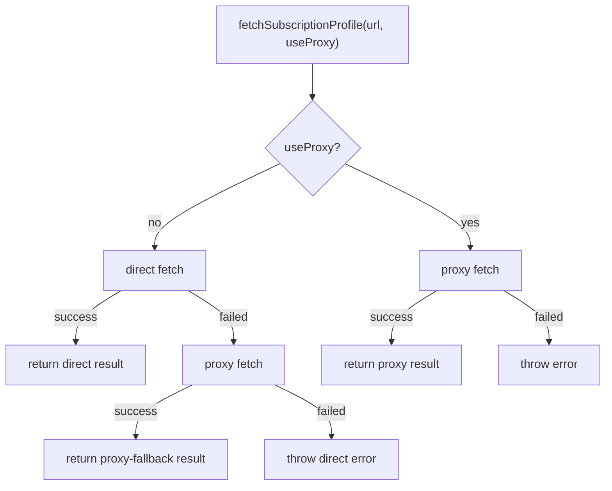
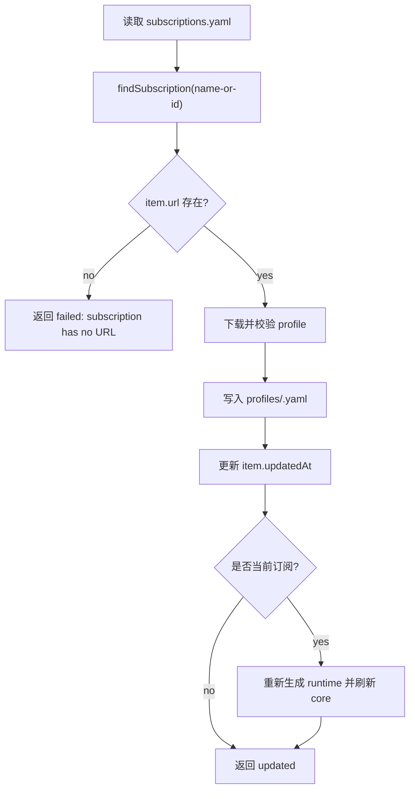
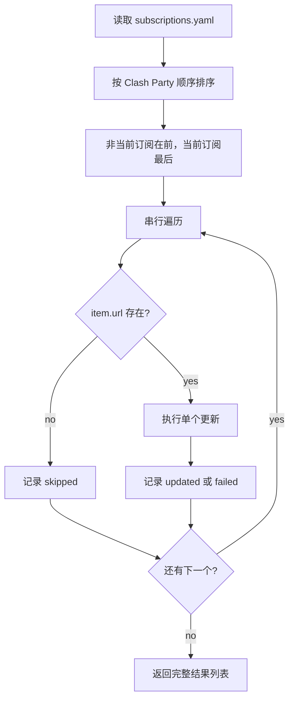

# SubscriptionUpdate_20260627

## 核心功能（WHAT）

新增 `mihoro-cli sub update` 命令，用于重新下载已有远程订阅并覆盖本地 profile。

```bash
mihoro-cli sub update <sub-name>
mihoro-cli sub update --all
mihoro-cli sub update <sub-name> --proxy
mihoro-cli sub update --all --proxy
```

单个更新沿用现有订阅查找规则，接受 name 或 id。批量更新通过 `-a/--all` 串行遍历全部订阅。代理更新通过 `-p/--proxy` 触发。最终结果用统一表格输出。

### 需求背景（WHY）

当前 `sub add` 可以添加远程订阅，`sub use` 可以切换当前订阅，但缺少“重新拉取已有订阅”的命令。用户需要在不重新输入 URL、不删除重建订阅的情况下更新订阅内容，并在更新当前订阅后立即让 runtime 和运行中的 mihomo core 使用新内容。

Clash Party 已有远程 profile 更新语义：默认先直连下载，直连失败后自动尝试通过本机 mihomo mixed-port 代理下载；显式 useProxy 时直接通过代理下载。mihoro-cli 的订阅更新需要完全对齐这个语义。

### 需求目标（GOAL）

- 用户可以通过 `sub update <name-or-id>` 更新单个远程订阅。
- 用户可以通过 `sub update --all` 串行更新全部可更新订阅。
- 用户可以通过 `--proxy` 显式指定直接走 mihomo mixed-port 代理下载。
- 默认下载行为按照 Clash Party：直连失败后自动代理 fallback。
- 更新当前订阅成功后，runtime config 和运行中的 mihomo core 都刷新到新订阅内容。
- 所有更新结果以表格输出，能清楚区分成功、失败和跳过。
- 批量更新不会因为单个失败提前停止。

### 范围边界

纳入范围：

- 新增订阅更新模块或扩展 `src/config/subscriptions.ts` 的更新能力。
- 新增 `sub update` 命令注册，支持 `<sub-name>`、`-a/--all`、`-p/--proxy`。
- 下载逻辑支持 direct、proxy、direct-then-proxy-fallback 三种路径。
- 更新成功后写入 profile 文件和订阅 `updatedAt`。
- 更新当前订阅后重新生成 runtime，并刷新运行中的 core。
- 批量更新聚合每个订阅的状态、下载模式、详情并用表格输出。
- 为下载模式选择、跳过无 URL 订阅、批量结果聚合、当前订阅刷新补充测试。
- 更新 README。

不纳入范围：

- 不新增定时自动更新。
- 不新增并发更新。
- 不新增 JSON 输出。
- 不实现 SubStore、auth token、user-agent、age 解密等 Clash Party 扩展能力。
- 不修改 Clash Party 源码。
- 不改变现有 `sub add` 的命令参数。

## 实现流程（HOW）

### 总体技术决策

采用“订阅更新服务 + CLI 结果渲染”的结构。订阅更新服务负责查找订阅、下载 profile、校验 profile、写入 profile 文件、更新 `subscriptions.yaml`、必要时刷新 runtime/core，并返回结构化结果。CLI 层只负责参数互斥校验、调用服务和使用 `formatTable()` 渲染结果。

更新能力建议放在 `src/config/subscriptions.ts` 或新增 `src/config/subscription-update.ts`。考虑到本需求需要依赖 runtime 生成和 core 刷新，推荐新增 `src/config/subscription-update.ts`，避免让 `subscriptions.ts` 继续扩大到运行态编排职责。

### 类型设计

建议新增内部类型：

```ts
export type SubscriptionUpdateStatus = 'updated' | 'failed' | 'skipped'

export type SubscriptionFetchMode = 'direct' | 'proxy' | 'proxy-fallback'

export interface SubscriptionUpdateOptions {
  useProxy: boolean
}

export interface SubscriptionUpdateResult {
  id: string
  name: string
  status: SubscriptionUpdateStatus
  mode?: SubscriptionFetchMode
  current: boolean
  updatedAt?: string
  detail: string
}
```

`mode` 表示最终实际使用的下载路径。默认直连成功时为 `direct`；默认直连失败后代理成功时为 `proxy-fallback`；显式 `--proxy` 成功时为 `proxy`。失败结果如果已经进入某个下载路径，也可以保留对应 `mode` 便于输出。

### 命令注册

在 `src/index.ts` 的 `sub` 命令组下新增：

```ts
sub
  .command('update')
  .argument('[name-or-id]')
  .option('-a, --all', 'update all subscriptions')
  .option('-p, --proxy', 'update through mihomo mixed-port proxy')
```

参数规则：

- 没有 `--all` 时必须提供 `[name-or-id]`。
- 有 `--all` 时不允许同时提供 `[name-or-id]`。
- `--proxy` 可以和单个更新或 `--all` 同时使用。
- 参数错误抛出 `MihoroError`，保持现有 CLI 错误格式。

### 下载流程

把现有 `fetchProfile()` 扩展为支持下载策略，或新增 `fetchSubscriptionProfile()`：



为了对齐 Clash Party，默认直连失败后尝试代理 fallback；如果代理 fallback 也失败，最终抛出直连错误，避免代理 fallback 掩盖原始直连失败原因。显式 `--proxy` 时只执行代理下载。

代理端点读取规则：

- `readConfig()` 获取 `proxyHost`。
- `readControlledConfig()` 获取 `mixed-port`。
- 如果 `mixed-port` 为 `0` 或非法，代理下载失败并给出明确错误。
- HTTP 代理地址为 `http://<proxyHost>:<mixed-port>`。

实现方式推荐复用仓库已有 `axios`。Clash Party 对订阅下载使用 axios 的 `proxy` 选项；mihoro-cli 已直接依赖 axios，因此可以使用同一类实现方式。请求保持现有 `mihoro-cli/0.1.0` 或调整为包版本化 User-Agent。响应仍按现有规则解析 YAML 并调用 `validateProfile()`。

### 单个更新流程

新增 `updateSubscription(idOrName, options)`：



单个指定到无 URL 订阅时应返回失败并由 CLI 以非 0 退出码结束。这里不使用 `skip`，因为用户明确指定了一个不能更新的对象。

### 批量更新流程

新增 `updateAllSubscriptions(options)`：



排序规则对齐 Clash Party：先处理非当前远程订阅，最后处理当前远程订阅。这样可以降低运行中的 core 在批量更新期间反复刷新当前 profile 的概率。由于本需求不做并发，所有结果按处理顺序汇总。

批量更新中无 URL 订阅返回 `skipped`。批量更新中单个下载或刷新失败返回 `failed`，但继续处理后续订阅。全部处理完成后，如果存在任意 `failed`，CLI 设置 `process.exitCode = 1`；只有 `updated` 和 `skipped` 时退出码为 `0`。

### 当前订阅 runtime 与 core 刷新

更新当前订阅成功后必须重新生成 runtime，并刷新 core。建议新增 helper：

```ts
async function refreshRuntimeForUpdatedSubscription(item: SubscriptionItem): Promise<string>
```

刷新策略复用 `sub use` 已确认语义：

- 始终调用 `generateRuntimeConfig()`。
- 如果 mihomo 正在运行，重启或刷新 core，使运行态加载新 runtime。
- 如果 mihomo 未运行，只保留新 runtime，下一次 `service start` 使用新订阅。

如果当前订阅的 profile 文件已经写入成功，但 runtime 或 core 刷新失败，结果应标记为 `failed`，详情说明失败发生在 runtime/core 刷新阶段。是否回滚 profile 不作为本轮目标，因为更新订阅本身已经成功下载并写入，新旧远程内容回滚缺少明确业务收益，也会增加备份和恢复复杂度。

### CLI 输出

结果表格使用 `formatTable()`。建议列：

```text
Subscription | ID | Current | Status | Mode | Detail
```

示例：

```text
Subscription update results:

┌──────────────┬──────────────┬─────────┬─────────┬────────────────┬───────────────────────────────┐
│ Subscription │ ID           │ Current │ Status  │ Mode           │ Detail                        │
├──────────────┼──────────────┼─────────┼─────────┼────────────────┼───────────────────────────────┤
│ Main         │ main         │ *       │ updated │ proxy-fallback │ updated at 2026-06-27T...Z    │
│ Local File   │ local-file   │         │ skipped │ -              │ subscription has no URL       │
│ Backup       │ backup       │         │ failed  │ direct         │ HTTP 403 Forbidden            │
└──────────────┴──────────────┴─────────┴─────────┴────────────────┴───────────────────────────────┘
```

单个更新也使用同一张表，保持输出一致。表格详情中不要打印完整敏感 URL；下载错误如果包含 URL，需要先脱敏或避免拼接原始 URL。

### 文件触点

- `src/config/subscription-update.ts`
  - 新增更新编排、批量更新、结果类型、当前订阅 runtime/core 刷新。
- `src/config/subscriptions.ts`
  - 导出或调整下载、校验、profile 写入相关 helper，供更新流程复用。
- `src/index.ts`
  - 注册 `sub update` 命令，渲染结果表格并设置退出码。
- `src/lib/types.ts`
  - 如需共享更新结果类型，可新增类型；若只在更新模块内部使用，则不改。
- `README.md`
  - 增加 `sub update` 用法和代理更新说明。
- `tests/subscription-update.test.mjs`
  - 覆盖更新策略、跳过无 URL 订阅、批量结果聚合和当前订阅刷新。

### 失败处理

- 目标订阅不存在：保持现有 `Subscription not found: <value>` 错误。
- 单个更新命中无 URL 订阅：返回失败结果并以非 0 退出。
- `--all` 命中无 URL 订阅：记录 `skipped`，继续后续订阅。
- 默认直连失败且代理 fallback 成功：返回 `updated`，`mode` 为 `proxy-fallback`。
- 默认直连失败且代理 fallback 失败：返回 `failed`，详情使用直连失败原因。
- 显式 `--proxy` 失败：返回 `failed`，详情使用代理失败原因。
- 当前订阅 runtime/core 刷新失败：返回 `failed`，详情标明刷新阶段失败，批量模式继续后续处理。
- 批量结果存在失败：全部处理完成后设置非 0 退出码。

## 测试用例

### 编译检查

- `pnpm run typecheck`
- `pnpm run build`

### 自动化检查

- `sub update <name-or-id>` 能按 name 或 id 找到订阅。
- 单个更新成功后写入 profile 文件并更新 `updatedAt`。
- 默认直连成功时不会调用代理下载，结果 `mode` 为 `direct`。
- 默认直连失败且代理成功时结果 `mode` 为 `proxy-fallback`。
- 显式 `--proxy` 时直接使用代理下载，结果 `mode` 为 `proxy`。
- 单个更新命中无 URL 订阅时结果为 `failed`。
- `--all` 遇到无 URL 订阅时结果为 `skipped`，并继续更新后续订阅。
- `--all` 中某个订阅失败时继续处理剩余订阅，最终结果包含全部订阅。
- 更新当前订阅成功后调用 runtime 生成与 core 刷新路径。
- 结果表格能展示 `updated`、`failed`、`skipped` 和实际下载模式。

### 手工检查

- 准备两个远程订阅和一个本地订阅，执行 `mihoro-cli sub update --all`，确认表格展示两个更新和一个跳过。
- 关闭直连可访问性但保持 mihomo 代理可用，执行不带 `--proxy` 的更新，确认结果显示 `proxy-fallback`。
- 执行 `mihoro-cli sub update <current>`，确认 `runtime/config.yaml` 更新时间变化，运行中的 mihomo core 使用更新后的 profile。
- 执行 `mihoro-cli sub update --all --proxy`，确认所有可更新订阅直接走代理路径。

### 回归检查

- `mihoro-cli sub add <name> <url>` 仍能添加远程订阅并生成 runtime。
- `mihoro-cli sub use <name-or-id>` 仍能切换订阅并刷新运行态。
- `mihoro-cli sub list` 表格输出不受影响。
- `mihoro-cli service start` 仍能使用当前订阅启动 mihomo。
