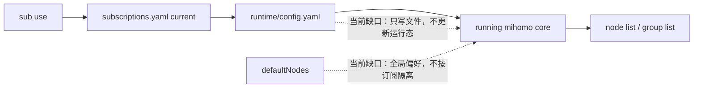

# 多订阅切换运行态一致性需求澄清

## 需求理解

用户要让 mihoro-cli 的多订阅切换行为对齐 Clash Party：切换当前订阅后，CLI 看到的节点列表、代理组列表、代理组选择状态，都必须对应新的当前订阅，而不是继续显示或沿用上一个订阅的运行态。

本需求把两个现象合并为一个需求：

- 当前问题：`sub use` 切换订阅后，运行中的 mihomo 没有加载新订阅，导致 `node list`、`group list` 仍来自旧订阅。
- 次级问题：代理组默认节点偏好当前是全局保存，切换订阅后可能把旧订阅的 group/node 选择应用到新订阅，造成错配或错误。

## 仓库现状关联

当前实现已经具备三块能力，但它们还没有组成完整的订阅切换闭环：

- `src/config/subscriptions.ts`：保存 `subscriptions.yaml.current`，能记录当前订阅。
- `src/config/runtime.ts`：能读取当前订阅 profile 并生成 `runtime/config.yaml`。
- `src/mihomo/api.ts`：`node list`、`group list` 读取运行中的 mihomo API。

现有缺口是：`src/index.ts` 的 `sub use` 只更新 current 并重新生成 runtime 文件，没有让运行中的 mihomo core 重新加载这份 runtime。Clash Party 的 `changeCurrentProfile` 在更新 current 后会热重载或重启 core，因此运行态和配置态会同步切换。

当前默认节点偏好保存在 `src/config/state.ts` 的 `defaultNodes` 中，作用域是全局配置。这个模型不能区分不同订阅下同名或异名代理组的选择偏好。

## 范围确认

本需求范围包含：

- 切换订阅时，当前订阅状态、runtime 配置、运行中的 mihomo 配置必须保持一致。
- 如果 mihomo 正在运行，切换订阅后 `node list` 和 `group list` 必须反映新订阅。
- 如果 mihomo 没有运行，切换订阅仍必须更新 current 和 runtime，下一次启动时使用新订阅。
- 默认代理组节点偏好必须具备订阅作用域，避免旧订阅的 group/node 选择污染新订阅。
- 切换失败时不能留下“订阅状态已切换，但运行态仍是旧订阅”的不一致状态。

本需求不包含：

- 新增 GUI。
- 修改 Clash Party 源码。
- 引入 Sub-Store、Smart Core、WebDAV 或 GUI 双向同步。
- 改变订阅下载、导入、删除的基础数据模型，除非为了订阅作用域偏好需要做兼容迁移。

## 成功标准

- 在已有多个订阅时，执行 `mihoro-cli sub use <name-or-id>` 后，`mihoro-cli sub list` 标记的新当前订阅与 runtime 文件使用的 profile 一致。
- mihomo 已运行时，切换订阅后 `mihoro-cli node list` 输出的是新订阅的节点集合。
- mihomo 已运行时，切换订阅后 `mihoro-cli group list` 输出的是新订阅的代理组集合和当前选择。
- 订阅 A 保存的默认代理组选择不会自动应用到订阅 B，除非订阅 B 自己保存过相同作用域下的选择。
- 切换订阅过程失败时，用户能看到明确错误；已持久化的 current、runtime 和运行态不能互相矛盾。

## 约束与兼容性

- 命令行行为需要以 Clash Party 的 profile 切换语义为参照：切换 profile 是配置态和运行态一起切换。
- 已有 `defaultNodes` 数据需要考虑兼容读取，避免升级后用户原有默认节点偏好直接失效。
- `node use` 和 `group use` 保存默认节点偏好时，应该和当前订阅绑定。
- `service start` 仍应能在启动时应用当前订阅下的默认节点偏好。

## 当前不需要额外决策

本轮需求边界已经明确：把“运行态未切换”和“默认节点偏好未按订阅隔离”合并处理为同一个多订阅切换一致性需求。下一步可以进入设计文档，决定使用重启、热重载，或两者组合的具体实现路线。
