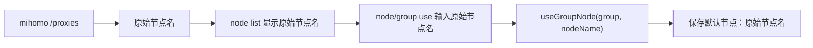
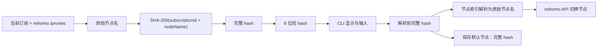

# 节点 Hash 索引需求澄清

## 需求理解

用户要为 mihoro-cli 引入一层 CLI 专属的节点标识与索引机制，让用户在命令行交互中像使用 Docker 短 ID 一样，用短 hash 指定、切换不同代理节点，并为不同代理组保存不同默认节点。

这个 hash 不是临时展示别名，也不是 mihomo 配置中的节点名替换，而是 mihoro-cli 自己的数据处理和保存逻辑：

- 每个节点基于 `subscriptionId + nodeName` 生成完整 hash。
- CLI 默认展示完整 hash 的前 8 位短 hash。
- 用户命令只允许使用 hash 或 hash 前缀指定节点，不再接受原始节点名作为节点参数。
- mihoro-cli 保存完整 hash，并在执行切换或应用默认节点时重新解析到当前订阅下的原始节点名。
- 调用 mihomo API 时仍使用原始节点名，因为 mihomo API 不认识 mihoro-cli 的 hash。

## 仓库现状关联

当前节点数据没有 mihoro-cli 自己的索引层，节点列表和节点切换都直接使用运行中的 mihomo API 返回的原始节点名：

- `src/mihomo/api.ts`：`listNodes()`、`listNodesWithGroups()`、`assertGroupCanUseNode()` 和 `useGroupNode()` 都围绕原始节点名工作。
- `src/index.ts`：`node list` 输出原始节点名；`node use <node> --group <group>` 和 `group use <group> <node>` 要求输入原始节点名。
- `src/config/state.ts`：`subscriptionDefaultNodes[subscriptionId][groupName]` 当前保存的是原始节点名。
- `src/lib/types.ts`：`MihomoProxy` 只有 mihomo API 原始字段，没有 CLI 节点 hash 类型。

当前链路：

目标链路：

## 范围确认

本轮纳入范围：

- 新增 mihoro-cli 专属节点索引，优先使用 JSON 持久化，方便程序处理。
- 使用 SHA-256 生成完整 hash，输入源为 `subscriptionId + nodeName`，实现时需要使用明确分隔符避免字符串拼接歧义。
- CLI 默认显示 8 位短 hash。
- 节点 hash 输入支持完整 hash 或任意长度 hash 前缀；8 位只是默认显示长度。
- 当 hash 前缀唯一时解析为对应节点；当前缀不存在或匹配多个节点时给出明确错误。
- `node list` 从运行中的 mihomo API 读取节点后刷新当前订阅的节点索引。
- `node use <hash> --group <group>` 只接受 hash 或 hash 前缀作为节点标识。
- `group use <group> <hash>` 只接受 hash 或 hash 前缀作为节点标识。
- 默认节点保存完整 hash；应用默认节点时必须通过节点索引重新解析为当前订阅下的原始节点名。
- 为旧的默认节点名数据提供兼容迁移或兼容读取方案，避免已有配置直接失效。

本轮不纳入范围：

- 不修改 mihomo profile 中的原始节点名。
- 不让 mihomo API 感知或保存 mihoro-cli hash。
- 不把代理组名改成 hash；本轮 group 参数仍使用原始代理组名。
- 不实现交互式 TUI。
- 不把节点 hash 设计为跨订阅稳定 ID；hash 明确按订阅隔离。

## 成功标准

- `mihoro-cli node list` 能显示每个节点的 8 位短 hash、原始节点名、类型和可选代理组。
- 用户可以使用 `mihoro-cli node use <hash> --group <group>` 切换代理组节点。
- 用户可以使用 `mihoro-cli group use <group> <hash>` 切换代理组节点。
- 节点参数为原始节点名时命令失败，并提示需要使用 `node list` 中的 hash。
- 默认节点保存完整 hash，不保存新的原始节点名。
- 服务启动时能把当前订阅保存的完整 hash 重新解析为当前节点名并应用到对应代理组。
- 节点列表变化后，重新执行 `node list` 能刷新索引；后续切换按新索引解析。
- hash 前缀不存在或不唯一时，错误信息能指导用户使用更长 hash 前缀或重新查看 `node list`。

## 已确认决策

- hash 算法使用 SHA-256。
- hash 输入源使用 `subscriptionId + nodeName`，实现时使用明确分隔符。
- CLI 只允许使用 hash 或 hash 前缀指定节点，不再允许原始节点名作为节点参数。
- CLI 默认展示 8 位短 hash。
- 短 hash 冲突时允许用户输入更长 hash 前缀或完整 hash。
- 节点索引与默认节点保存需要引入 mihoro-cli 自己的数据处理逻辑；持久化格式优先考虑 JSON。
