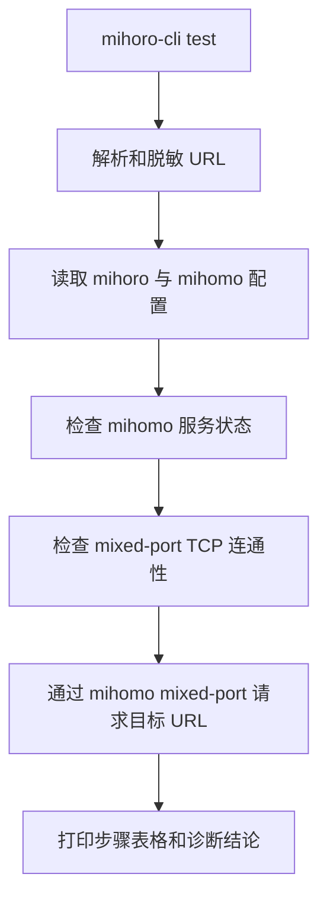

# 代理测试诊断命令需求澄清

## 需求理解

用户要为 mihoro-cli 增加一个诊断命令：

```bash
mihoro-cli test <url>
```

该命令用于检查用户给定 URL 通过 mihoro/mihomo 代理链路访问时的连接过程。它的核心目标不是简单返回可访问或不可访问，而是把关键步骤和失败位置清楚打印出来，帮助用户判断问题出在 URL 输入、本地 mihoro 配置、mihomo 服务状态、代理端口、代理转发、DNS/TCP/TLS/HTTP 请求，还是目标服务自身返回错误。

已确认命令默认经 mihoro 的 `mixed-port` 代理访问目标 URL，不做直连对比。

## 仓库现状关联

当前仓库已有与该需求相关的基础能力：

- `src/index.ts` 使用 `commander` 注册 CLI 命令，适合新增顶层 `test <url>` 命令。
- `src/config/state.ts` 提供 mihoro 用户配置读取能力，其中包含 `proxyHost`。
- `src/config/controlled.ts` 提供 mihomo 受控配置读取能力，其中包含 `mixed-port`。
- `src/service/service.ts` 和 `src/mihomo/core.ts` 已有 mihomo 启动状态、代理端口就绪检查等逻辑。
- `src/mihomo/api.ts` 通过 Unix socket 访问 mihomo API，可用于判断运行中的 mihomo API 是否可用。
- `src/lib/table.ts` 已提供统一表格输出，适合美化诊断步骤结果。
- `src/lib/errors.ts` 已提供一致的 CLI 错误格式。

当前链路中，`proxy enable` 会主动生成 runtime、启动或重启 mihomo、验证代理端口并启用系统代理。新诊断命令的语义不同：它只观察和诊断，不修改配置、不启动进程、不切换节点。

诊断链路如下：



## 范围确认

本轮纳入范围：

- 新增 `mihoro-cli test <url>` 顶层命令。
- URL 参数只接受 `http://` 和 `https://`。
- 命令默认通过 mihoro 配置中的 `proxyHost` 与受控 mihomo 配置中的 `mixed-port` 访问目标 URL。
- 按步骤打印诊断结果，至少覆盖：
  - URL 解析与脱敏展示。
  - mihoro 配置读取。
  - mihomo 服务状态。
  - mihomo API 可用性。
  - mixed-port TCP 端口连通性。
  - 经代理访问目标 URL 的 HTTP 结果。
- 拿到 HTTP 响应状态码即表示代理链路已连通；`4xx/5xx` 归类为目标服务返回错误，不归类为代理链路失败。
- 默认脱敏 URL 中的 username/password，以及常见敏感 query 参数。
- 使用人类可读的美化输出，优先复用现有表格输出风格。
- 失败时尽量给出明确失败阶段和下一步排查提示。

本轮不纳入范围：

- 不自动启动、重启或停止 mihomo。
- 不修改 mihoro 配置、mihomo 配置、系统代理设置或节点选择。
- 不做直连与代理访问对比。
- 不新增 `--json` 机器可读输出。
- 不做批量节点测速、代理组批量测试或 TUI。
- 不做 traceroute、抓包、完整证书链分析或浏览器级渲染测试。

## 成功标准

- `mihoro-cli test https://example.com` 能输出清晰的分步骤诊断结果。
- mihomo 未运行时，命令能指出服务状态或 API/端口检查失败，不会尝试启动服务。
- mixed-port 未监听时，命令能指出代理端口不可用。
- URL 格式错误或协议不支持时，命令能给出明确错误。
- 经代理请求成功并拿到状态码时，命令能展示 HTTP 状态、耗时和诊断结论。
- 目标服务返回 `4xx/5xx` 时，输出能说明代理链路已到达目标服务，但目标服务返回错误状态。
- 输出中不会暴露 URL 的账号密码和常见敏感 query 值。

## 已确认决策

- 默认经 mihoro 的 `mixed-port` 代理访问 URL。
- 命令只诊断，不自动启动、不重启、不修改配置。
- 拿到 HTTP 响应状态码就视为代理链路连通。
- `4xx/5xx` 归类为目标服务返回错误。
- URL 中的账号密码和敏感 query 默认脱敏。
- 本轮只做人类可读输出，不增加 `--json`。
