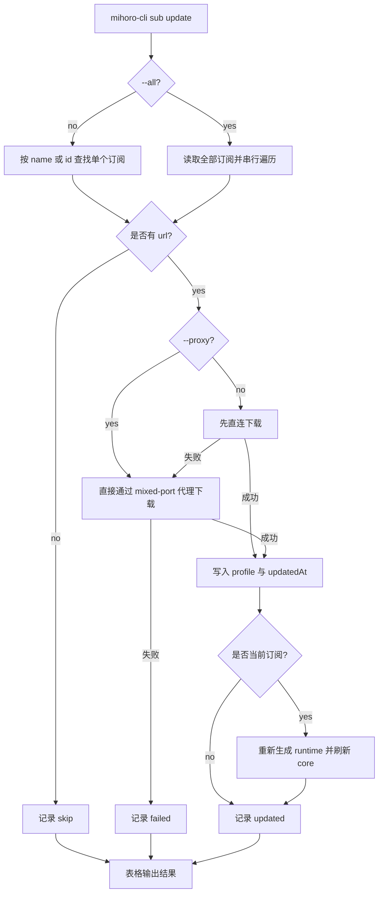

# 订阅更新命令需求澄清

## 需求理解

用户要为 mihoro-cli 增加订阅更新命令：

```bash
mihoro-cli sub update <sub-name>
mihoro-cli sub update --all
mihoro-cli sub update <sub-name> --proxy
mihoro-cli sub update --all --proxy
```

该命令用于重新下载已有远程订阅并覆盖本地 profile。单个更新沿用现有订阅定位规则，参数虽然叫 `sub-name`，实际接受订阅 name 或 id。批量更新使用 `-a/--all`，串行处理所有订阅，直到遍历完成为止。`-p/--proxy` 表示本次更新直接通过 mihomo mixed-port 代理下载。

代理下载语义完全按照 Clash Party：默认先直连下载；如果直连失败，自动尝试通过 mihomo mixed-port 代理下载；如果用户显式传入 `--proxy`，直接通过 mihomo mixed-port 代理下载。

## 仓库现状关联

当前仓库已有与该需求相关的基础能力：

- `src/index.ts` 使用 `commander` 注册 `sub add/list/use/remove`，适合在同一个 `sub` 命令组下新增 `update`。
- `src/config/subscriptions.ts` 负责读取和写入 `subscriptions.yaml`，现有 `addSubscription()` 已包含远程订阅下载、YAML 解析、profile 校验、profile 文件写入和订阅元数据写入。
- `src/config/runtime.ts` 的 `generateRuntimeConfig()` 会基于当前订阅 profile 重新生成 `runtime/config.yaml`。
- `src/config/subscription-switch.ts` 已有订阅切换后的运行态刷新编排，可以作为“当前订阅更新成功后刷新 core”的参考。
- `src/config/controlled.ts` 和 `src/config/state.ts` 能提供 mihomo `mixed-port` 与 mihoro `proxyHost`，用于构造代理下载端点。
- `src/lib/table.ts` 已提供统一表格输出，适合展示批量更新结果。

当前 `addSubscription()` 只支持直接下载，没有代理下载和“更新已有订阅”的结果汇总。订阅数据结构中 `url` 是可选字段，导入自本地文件或 Clash Party 本地 profile 的订阅可能没有远程 URL，因此 `--all` 会遇到可更新订阅和不可更新订阅混合存在的情况。

Clash Party 的更新行为可以概括为：远程 profile 更新等价于重新执行 profile 创建/更新流程；默认直连失败后尝试代理 fallback；显式 useProxy 时直接走代理；更新全部时串行更新，先处理非当前远程订阅，最后处理当前远程订阅。

订阅更新链路如下：



## 兼容代价评估

本需求明确要求完全按照 Clash Party 的更新语义，因此默认直连失败后的代理 fallback 是需求范围，而不是可选兼容层。这样会让“不带 `--proxy`”也可能最终通过代理更新成功，输出结果需要体现实际下载模式，否则用户无法判断本次更新到底走了 direct 还是 proxy fallback。

保留无 URL 订阅的兼容处理是必要的，因为当前订阅模型已经允许本地导入订阅存在。单个更新命中无 URL 订阅时直接失败能避免用户误以为已经更新；`--all` 遇到无 URL 订阅时跳过并输出 `skip`，可以避免一个本地订阅阻断全部远程订阅更新。

批量更新采用串行全量执行会增加结果聚合和退出码判定逻辑，但行为清晰：每个订阅都有独立结果，失败不会隐藏后续订阅状态。若改成遇错即停，会偏离用户确认的“直到更新所有订阅”。

## 范围确认

本轮纳入范围：

- 新增 `mihoro-cli sub update <sub-name>`，沿用现有 name 或 id 匹配规则。
- 新增 `-a/--all`，串行更新所有订阅并遍历完成。
- 新增 `-p/--proxy`，显式要求直接通过 mihomo mixed-port 代理下载。
- 默认更新语义完全对齐 Clash Party：先直连，直连失败后自动尝试代理 fallback。
- 更新成功后覆盖对应 profile 文件并刷新订阅 `updatedAt`。
- 更新当前订阅成功后重新生成 runtime，并刷新正在运行的 core。
- `--all` 遇到无 URL 订阅时跳过并在结果表格中标记 `skip`。
- 所有订阅处理完成后，用表格向用户展示每个订阅的更新结果。
- 批量更新存在失败时，已成功更新的订阅保留，命令在汇总后返回失败退出码。
- 补充自动化测试、README 命令说明和必要的实现文档。

本轮不纳入范围：

- 不新增定时自动更新。
- 不新增 SubStore、auth token、user-agent、age 解密等 Clash Party 扩展能力。
- 不并发更新订阅。
- 不修改 Clash Party 源码。
- 不新增 JSON 输出。
- 不改变 `sub add` 的命令参数和用户界面，除非实现复用时需要让下载能力共享。

## 成功标准

- `mihoro-cli sub update <name-or-id>` 能重新下载目标远程订阅，覆盖本地 profile，并更新 `updatedAt`。
- `mihoro-cli sub update --all` 能串行处理全部订阅，跳过无 URL 订阅，失败不阻断后续订阅。
- 不带 `--proxy` 时，直连失败后会自动尝试 mihomo mixed-port 代理 fallback。
- 带 `--proxy` 时，直接通过 mihomo mixed-port 代理下载。
- 更新当前订阅成功后，`runtime/config.yaml` 与运行中的 mihomo core 都使用更新后的订阅内容。
- 批量更新结果以表格展示，能区分 `updated`、`failed`、`skipped`，并展示实际下载模式和失败原因。
- 批量更新存在失败时，命令完成全部遍历后以非 0 退出码结束。

## 已确认决策

- 代理更新行为完全按照 Clash Party，不做自定义简化。
- 单个订阅参数沿用现有 name 或 id 匹配规则。
- `--all` 遇到无 URL 订阅时跳过并输出 `skip`。
- 更新当前订阅后重新生成 runtime，并刷新 core。
- 批量更新串行执行，直到更新所有订阅，然后使用表格向用户表达更新结果。
